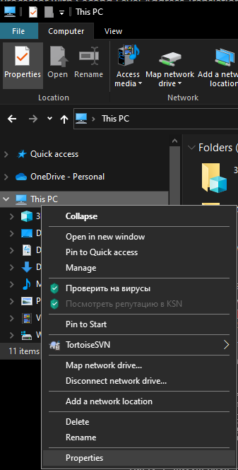
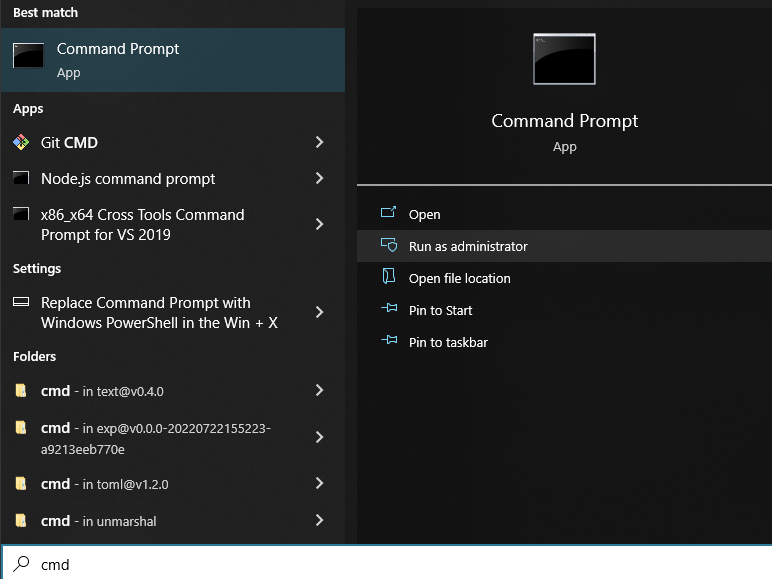
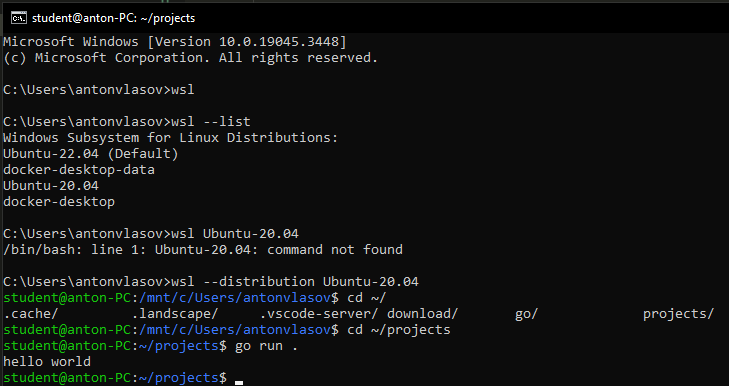
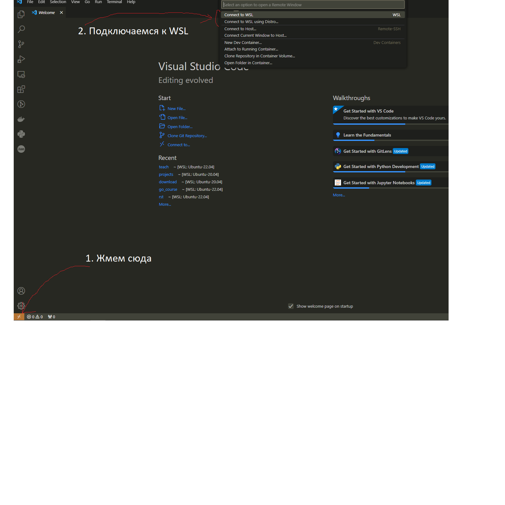
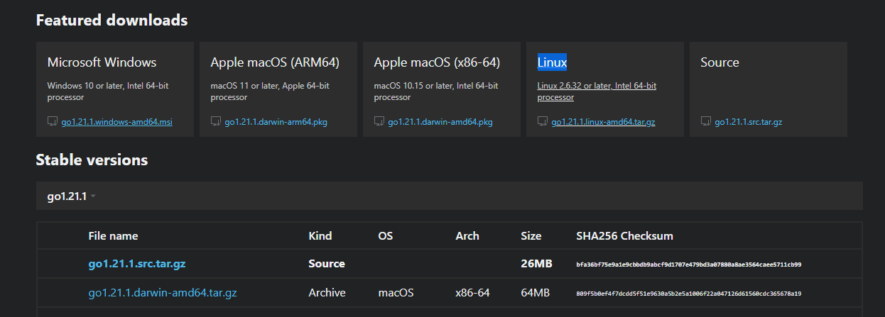

# Гайд по установке окружения

## Предисловие
Для прохождения курса каждому понадобится поставить следующий список вещей:

- go
- IDE (vscode)
- go tools
- git
- Docker

Рекомендуется один из трех вариантов установки, в зависимости от ваших предпочтений:
1. Windows + WSL2. Подойдет если у вас Windows 10/11. По нашему мнению является самым удобным вариантом если вы не хотите использовать Linux как основную ОС. У вас  будет возможность быстро запускать виртуальную машину с Linux из под Windows и все связанные с программированием вещи делать в этой виртуальной машине. На сегодняшний день у WSL хорошая поддержка в VSCode и Goland, после первой установки проблем возникать не должно.
2.  Вы уже используете Linux как ОС для вашей машины или очень хотите попробовать dual boot с Linux. Если у вас уже стоит Linux, просто ставьте окружение на него по гайду ниже. Ставить linux специально для курса не рекомендуем, так как будете тратить много времени на решение задач не связанных с написанием прокта.
3.  У вас Mac. Все должно ставиться по аналогии с Linux, но могут быть какие-то особенности.

Мы постарались сделать описание установки максимально понятным и унифицированным, но у кого-то могут возникнуть индивидуальные проблемы. Сейчас самый важный навык для программиста - уметь гуглить, поэтому если возникают проблемы, попытайтесь найти их решение через google. Быстрее всего найти ответ можно если пользоваться именно google, делать запросы на английском языке и смотреть результаты с сайта stackoverflow. Если вы не смогли решить возникшую проблему самостоятельно, пишите в общий чат, попробуем помочь.

# Windows
## Проверенный 09.2024 гайд по установке WSL на Windows 11.
1. Следуйте [гайду Microsoft](https://learn.microsoft.com/en-us/windows/wsl/install-manual) до пункта 5 включительно **в пункте 4 выполните именно wsl --update, а не wsl --install**
2. Вместо установки голого дистрибутива из пункта 6 гайда Microsoft [импортируем подготовленный нами образ](#импорт-подготовленного-дистрибутива-общий-2023-и-2024)

## Рабочий гайд с 2023 года, чуть больше этапов.
#### Проверка доступности WSL
1. Проверьте что на вашей машине можно использовать WSL согласно [инструкции] https://learn.microsoft.com/en-us/virtualization/hyper-v-on-windows/reference/hyper-v-requirements. Версию windows можно проверить если в файловом проводнике кликнуть правой кнопкой мыши на "This PC" и нажать "Properties".  Войти в cmd чтобы выполнить ```systeminfo``` можно если ввести в поиске cmd и запустить от имени администратора. 
2. Если у вас не подходит версия windows или в ответе ```systeminfo``` вы видете ```VM Monitor Mode Extensions: No``` или ```Second Level Address Translation: No```, вы не сможете использовать WSL на данной машине. В таком случае у вас следующие варианты:
   - Можете проапгейдить windows до подходящего уровня и поставить WSL
   - Можете поставить Ubuntu как вторую ОС и следовать инструкции для Linux
   - Можете поставить все на Windows, но это худший вариант. При работе на Windows будут ломаться совершенно неожиданные вещи про которые тяжело найти информацию в интернете и мы не сможем вам помочь. Лучше поставьте Ubuntu как вторую ОС, это не так сложно.
3. Если можно поставить WSL, переходим к главе [установка WSL](#установка-wsl)


#### Установка WSL
Самый сложный этап, так как на винде уже предустановлена WSL, но, зачастую, неправильной версии. Мы собрали для вас ресурсы где описывается то как можно правильно поставить WSL2. Также важно обратить внимание на то что на сегодняшний день WSL2 и VirtualBox не могут работать одновременно. Однако между ними можно переключаться, так что доступ к VirtualBox не будет потерян.

1. Если у вас при проверке ```systeminfo``` вывело ```No``` в ```Virtualization Enabled In Firmware``` или ```Data Execution Prevention Available```, вам нужно включить эти пункты в BIOS. Инструкция зависит от вашей материнской карты, погуглите как это сделать.
2. Ставим HyperV: запускаем PowerShell от имени администратора (подобно cmd, это другая консоль), выполняем ```Dism /Online /Enable-Feature /FeatureName:Microsoft-Windows-Subsystem-Linux /all```. Вам предложит перезагрузить компьютер, сохраняем всю работу и жмем ```y``` или перезапускаем компьютер вручную.
3. Запускаем cmd от имени администратора.
4. Выполняем команду ```wsl --version```. Если команда выполнится с ошибкой или мы увидим что версия wsl ниже 0.67.6, значит нам требуется установить новую WSL. Проще всего это сделать через microsoft store по данной ссылке https://aka.ms/wslstorepage.

## Импорт подготовленного дистрибутива (общий 2023 и 2024)
1. Скачиваем подготовленный дистрибутив [тут](https://drive.google.com/file/d/14d4YL8Z-HQqo5gdA5fz6q-RR7oeQiPGL/view?usp=sharing).
2. Устанавливаем его командой 
    ```wsl.exe --import Ubuntu-20.04-bolshoi <InstallLocation> <FileName>```
    InstallLocation - место где будут храниться внутренние файлы WSL, можно указать c:\\ubuntu-20.04-bolshoi
    FileName - путь к скачанному tar из п. 1
3. Проверяем что ubuntu установилась - пишем 
    ```wsl --list```
    Мы должны увидеть наше название - ubuntu-20.04-bolshoi
4. Запускаем нашу убунту.
    ```wsl --distribution Ubuntu-20.04-bolshoi```
5.  Мы должны увидеть что наш пользователь - student (первое что идет в строке консоли). Пароль нашего пользователя - student. При желании потом можно поменять юзера и пароль.
6. Проверяем что go работает:
    ```
    cd ~/projects
    go run .
    ```
    Должны получить такой же результат
    
7. Проверяем что у нас включен systemd:
    ```
    sudo cat /etc/wsl.conf
    ```
    Должны увидеть systemd=true

Установка Ubuntu через WSL завершена, нужно закрыть терминал

#### Установка и подключение vscode
1. Устанавливаем и открываем vscode https://code.visualstudio.com/download
2. Подключаемся к WSL. Можно выбрать вариант connect to WSL если у вас наша убунта является дефолтным дистрибутивом в WSL (при ```wsl --list``` напротив названия стоит (default)). Иначе нужно выбрать Connect to WSL using Distro и выбрать Ubuntu-20.04-bolshoi.
   
3. Заходим в нашу папку проекта. Слева сверху нажимаем 
    ```File->Open Folder->/home/student/projects```
4. Открываем консоль сочетанием клавиш ``` ctrl+` ```
5. Проверяем что программа на go работает - пишем в консоли внутри vscode ```go run .``` Мы должны получить тот же результат что и при тесте установки WSL.
6. Проводим настройку VSCode. В полученном дистрибутиве уже может быть установлено расширение на go, не нужно удивляться если это так, просто пропускаем шаг настройки. Настройка описана в секции [Настройка VSCode](#настройка-vscode)


#### Заключение
Теперь у вас есть IDE и ОС со всем что нам понадобится во время курса. На занятиях мы покажем как работать с IDE, но можете уже сейчас попробовать написать некоторый код и позапускать его. Мы рекомендуем вам начать смотреть [a tour of go](https://go.dev/tour/welcome/1) - минималистичный гайд от создателей языка о том как им пользоваться. Первые занятия мы будем смотреть и обсуждать некоторые моменты более глубоко, рекомендуем изучить материал заранее самостоятельно, потом будет проще его обсуждать.

## Linux
1. Устанавливаем go 1.23.1 согласно инструкции с оф. сайта https://go.dev/doc/install. Выбираем архив с go в зависимости от своей архитектуры, скорее всего вам подойдет вариант Linux из Featured Downloads.
2. Устанавливаем Docker и добавляем нашего юзера в группу docker 
    ```
    https://docs.docker.com/engine/install/ubuntu/#install-using-the-repository
    https://docs.docker.com/engine/install/linux-postinstall/#manage-docker-as-a-non-root-user
    ```
3. Устанавливаем git https://git-scm.com/download/linux
4. Устанавливаем vscode https://code.visualstudio.com/download и настраиваем. [Настройка VSCode](#настройка-vscode)
5. Читаем [заключение](#заключение)

## Mac
Следуем инструкции для Linux, скачивая файлы выбираем версии для вашей архитектуры.

## Настройка VSCode
1. Добавляем extension для go 
2. Устанавливаем инструменты для упрощения работы с кодом. Нажимаем сочетание клавиш ```ctrl+shift+P```, пишем в открывшуюся строку go tools, выбираем стрелочками или мышкой Go: Install/Update tools и жмем Enter.

