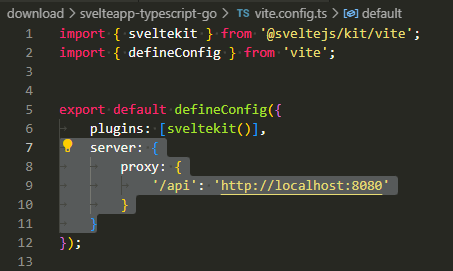
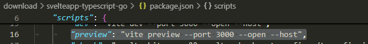
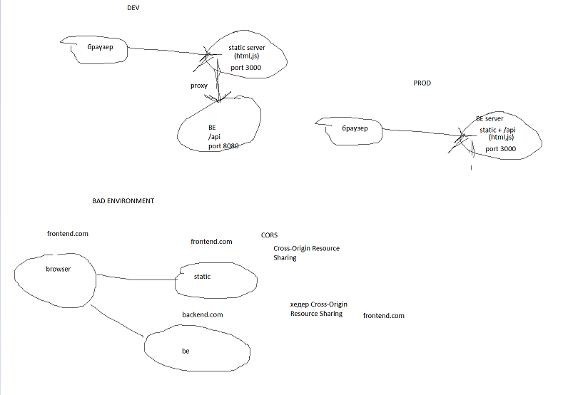

# Интеграция с фронтендом
Как сростить реакт приложение с голангом https://observiq.com/blog/embed-react-in-golang
Пример прокта svelte + golang который был рассмотрен на занятии https://github.com/alankrantas/svelteapp-typescript-go

Как включить прокси сервер для фронта:

Как я запускал фронт который подцеплялся к отдельному беку при помощи прокси:

# CORS
https://habr.com/ru/companies/macloud/articles/553826/ (оно вам не нужно если правильно сделаете сервер)

# Микросервисы
Outbox https://microservices.io/patterns/data/transactional-outbox.html
Saga https://microservices.io/patterns/data/saga.html
Основная статья про микросервисы на сайте https://microservices.io/patterns/microservices

Рекомендую книгу Высоконагруженные Приложения O'Reilly (кабанчик). Хотя она и немного устарела в плане используемых технологий (монга еще такая молодая, все пишут на Джаве), в ней подробно рассматриваются важные паттерны. В целом можете посмотреть оглавление и самостоятельно искать всю информацию в интернете.
